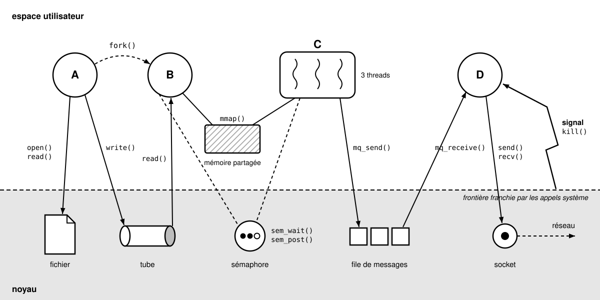

## Systèmes d'exploitation

L'ensemble des documents provient du cours de systèmes d'exploitation présenté de 2012 à 2014 à l'université [Paris-Est Créteil](http://www.u-pec.fr/) et depuis 2016 à l'[ENSICAEN](http://www.ensicaen.fr).
<!--
### Licences

* Les documents (cours, sujets de travaux pratiques et images) sont fournis sous licence Creative Commons [CC BY-NC 4.0](https://creativecommons.org/licenses/by-nc/4.0/) 
-->

Les éléments de solutions et les exemples de code sont diffusés sous licence [Apache 2.0](https://www.apache.org/licenses/LICENSE-2.0) .

-----

## Operating Systems

All documents are from my operating systems course, taught from 2012 to 2014 at [Paris-Est University](http://www.u-pec.fr/) and since 2016 at [ENSICAEN](http://www.ensicaen.fr).
<!--
### Licensing

* The documents (courses, laboratory work handouts and images) are provided under the Creative Commons [CC BY-NC 4.0](https://creativecommons.org/licenses/by-nc/4.0/) license  
-->

Code samples are provided under the [Apache 2.0](https://www.apache.org/licenses/LICENSE-2.0) license .