[//]: # (---------------------------------------------------------------------)

[//]: # (                      SYSTEMES D'EXPLOITATION                        )

[//]: # (                 Alain LEBRET, ENSICAEN 2016-2018                    )

[//]: # (---------------------------------------------------------------------)

[//]: # (Guide MARP : https://github.com/fredtempez/MARP_Guides               )

[//]: # (Couleurs : https://www.w3schools.com/colors/colors_names.asp         )

[//]: # (---------------------------------------------------------------------)

<style>
.slide { /* background-color: rgba(26, 26, 26, 0.8); */ /* color: white; */ }
.slide h1 { font-family: "Yanone Kaffeesatz"; }
.slide h2 { font-family: "Yanone Kaffeesatz"; }
.slide h3 { font-family: "Yanone Kaffeesatz"; color: darkslategray; }
.slide b { color: darkred; }
.slide a { color: steelblue; } 
.slide pre { /* background-color: rgba(26, 206, 206, 0.4); */ color: indigo; font-family: "Ubuntu Mono"; }
.slide code { color: darkslategray; font-family: "Ubuntu Mono"; }
.right { float: right; padding: 20px 20px 20px 20px; }
.left { float: left; padding: 20px 20px 20px 20px; }
</style>

[//]: # (---------------------------------------------------------------------)

<!-- $size: 4:3 -->
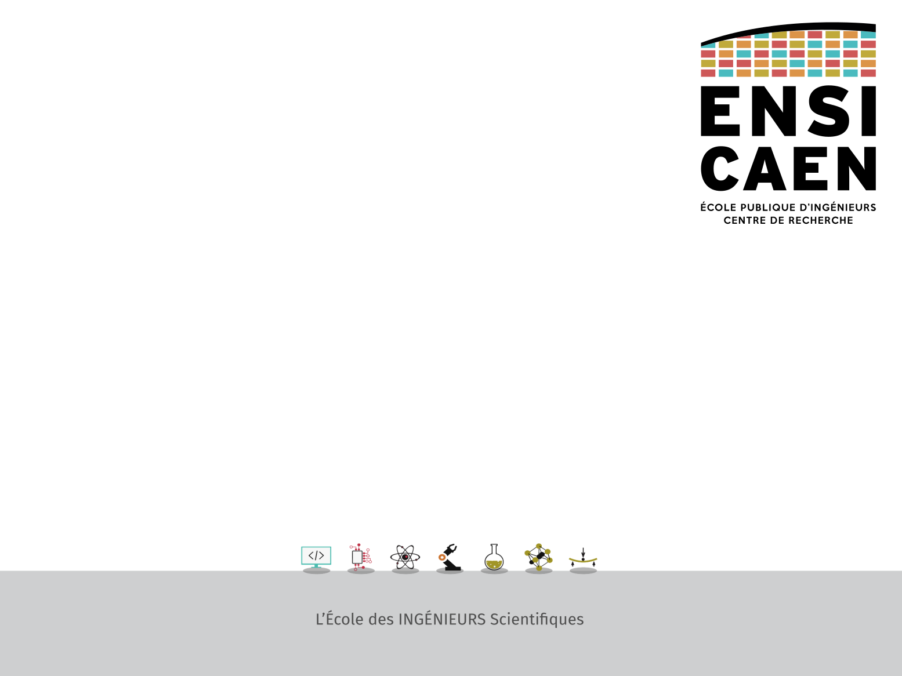
# Systèmes d'exploitation
### _Info 2A & 1A APP_
_alain.lebret@ensicaen.fr_

[//]: # (---------------------------------------------------------------------)

---

<!-- page_number: true -->
# Systèmes d'exploitation
## Fichiers et entrées-sorties

[//]: # (---------------------------------------------------------------------)

---

# Systèmes d'exploitation
## Fichiers et entrées-sorties : introduction

[//]: # (---------------------------------------------------------------------)

---

# Système de gestion de fichiers
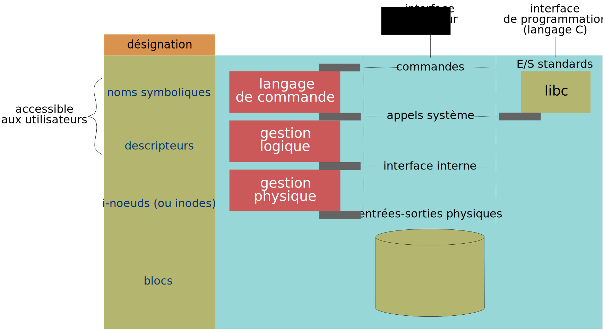

[//]: # (---------------------------------------------------------------------)

---

# Exemples de systèmes de gestion de fichiers

|   **SGF**  | **OS** initial | 
|  --------- | -------------- | 
|    FAT32   |   Ms-Windows   | 
|    NTFS    |   Ms-Windows   |
|    exFAT   |   Ms-Windows   | 
|     ext    |     Linux      |
|    ext2    |     Linux      |
|    ext3    |     Linux      | 
|    ext4    |     Linux      | 
|    HFS+    |    Mac OS X    | 


[//]: # (---------------------------------------------------------------------)

---

# Stockage des fichiers sous UNIX

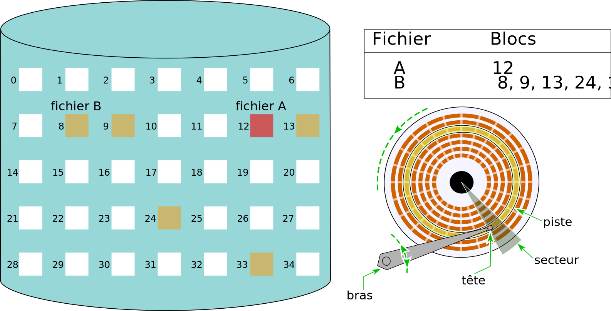

[//]: # (---------------------------------------------------------------------)

---

# Stockage des fichiers : taille des blocs
```c
#include <stdio.h>
#include <stdlib.h>
#include <sys/statvfs.h>

int main(void)
{
   struct statvfs stat;
   int size 
   
   size = statvfs("/", &stat);
   printf("FS block size: %lu bytes \n", (stat.f_bsize));
   
   exit(EXIT_SUCCESS);
}
```

[//]: # (---------------------------------------------------------------------)

---

# Notion d'i-noeud
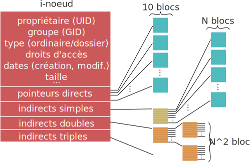

[//]: # (---------------------------------------------------------------------)

---

# Connaître un i-noeud : "ls -i" ou stat

## Exemple d'un fichier
```
$ ls -li zero_sum_game.c
40664348 -rw-r--r--+ 1 alebret prof 1675 sept. 20  2017 zero_sum_game.c
$
$ stat zero_sum_game.c
Fichier : 'zero_sum_game.c'
Taille : 1675      Blocs : 8          Blocs d'E/S : 16384  fichier
Périphérique : 2bh/43d	Inoeud : 40664348    Liens : 1
Accès : (0644/-rw-r--r--)  UID : (200021/ alebret)   GID : (2000/ prof)
Accès : 2017-09-20 10:17:18.352303900 +0200
Modif. : 2017-09-20 10:16:23.676303900 +0200
Changt : 2017-09-20 10:16:23.676303900 +0200
Créé : -
```

[//]: # (---------------------------------------------------------------------)

---

# Connaître un i-noeud : stat

## Exemple du dossier personnel
```
$ stat ~
Fichier : '/home/prof/alebret'
Taille : 0         Blocs : 0         Blocs d'E/S : 16384  répertoire
Périphérique : 2bh/43d	Inoeud : 40634743    Liens : 39
Accès : (0710/drwx--x---)  UID : (200021/ alebret)   GID : (2000/    prof)
Accès : 2018-05-15 03:18:06.060263000 +0200
Modif. : 2018-01-22 16:25:46.687307000 +0100
Changt : 2018-05-15 00:30:03.552263000 +0200
Créé : -
```

[//]: # (---------------------------------------------------------------------)

---

# Table des i-noeud et dossiers
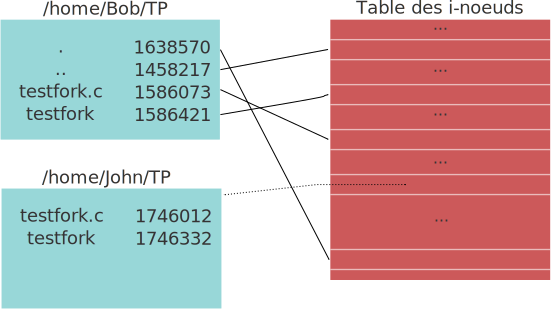


[//]: # (---------------------------------------------------------------------)

---

# Systèmes d'exploitation
## Fichiers et entrées-sorties : flots d'entrées/sorties

[//]: # (---------------------------------------------------------------------)

---

# Appels systèmes d'accès aux fichiers
## Ouverture
```c
#include <sys/types.h>
#include <fcntl.h>
#include <unistd.h>

int open(const char *pathname, int flags);
```
### Exemple
```c
fd = open("/home/paul/TP/testfork.c", O_RDONLY);
```

## Fermeture
```c
#include <unistd.h>

int close(int fd);
```

[//]: # (---------------------------------------------------------------------)

---

# Appels systèmes d'accès aux fichiers
## Déplacement du pointeur
```c
#include <sys/types.h>
#include <unistd.h>

off_t lseek(int fd , off_t offset , int whence);
```

### Exemples
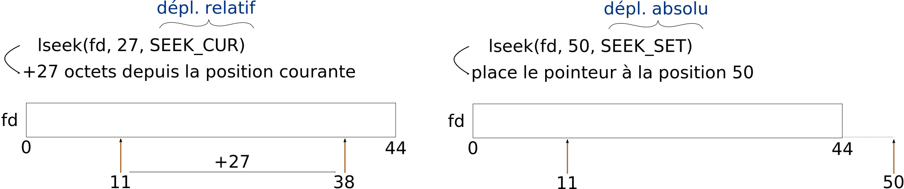

[//]: # (---------------------------------------------------------------------)

---

# Appels systèmes d'accès aux fichiers
## Lecture

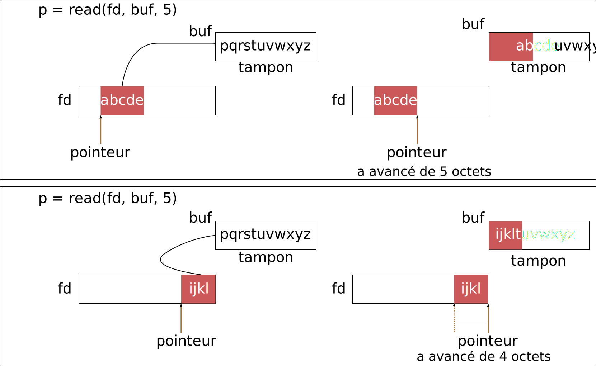

[//]: # (---------------------------------------------------------------------)

---

# Appels systèmes d'accès aux fichiers
## Écriture
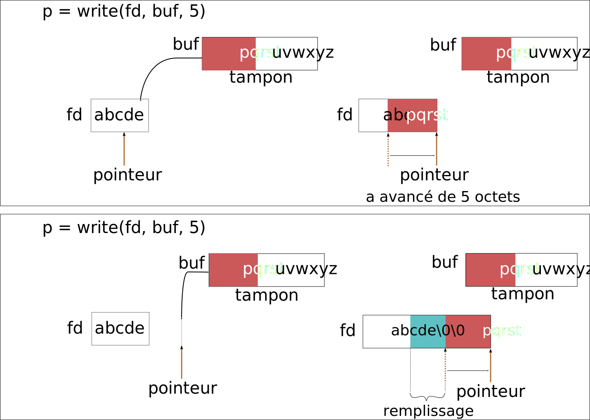

[//]: # (---------------------------------------------------------------------)

---

# Flots d'entrée/sortie

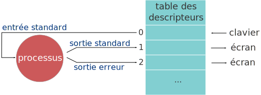


[//]: # (---------------------------------------------------------------------)

---

# Manipuler les flots d'entrée/sortie : redirection

-   Flots et tubes sont manipulables par des appels système
-   La redirection des flots d'E/S peut être réalisée à l'aide de la famille de primitives `dup()`
```c
#include <unistd.h>

int dup(int fd);
int dup2(int oldfd, int newfd);
```

[//]: # (---------------------------------------------------------------------)

---

# Manipuler les flots d'entrée/sortie : redirection
```c
fid = dup(fd);
```
est équivalent à :
```c
fid = fcntl(fd, F_DUPFD, 0);
```
et
```c
fid = dup2(oldfd, newfd);
```
est équivalent à :
```c
close(newfd);
fid = fcntl(oldfd, F_DUPFD, newfd);
```

[//]: # (---------------------------------------------------------------------)

---

# Manipuler les flots d'entrée/sortie : redirection

## Exemple
```sh
$ cat > temp.txt # CTRL-D pour terminer
```
```c
fd = open("temp.txt", ...);
dup2(fd, 1); /* 1 est le descripteur de la sortie écran */
/* ... */
close(fd)
```

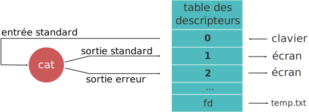

[//]: # (---------------------------------------------------------------------)

---

# Manipuler les flots d'entrée/sortie : redirection

## Exemple
```sh
$ cat > temp.txt # CTRL-D pour terminer
```
```c
fd = open("temp.txt", ...);
dup2(fd, 1); /* 1 est le descripteur de la sortie écran */
/* ... */
close(fd)
```


[//]: # (---------------------------------------------------------------------)

---

# Systèmes d'exploitation
## Fichiers et entrées-sorties : communication interprocessus

[//]: # (---------------------------------------------------------------------)

---

# Communications interprocessus par tubes anonymes

```c
#include <unistd.h>

int pipe(int fd[2]);
```
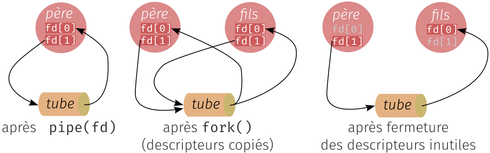


[//]: # (---------------------------------------------------------------------)

---

# Programmation d'un tube père - fils
```c
#define INPUT 1
#define OUTPUT 0
#define KEYBOARD 0
#define BYTE_SIZE 1

int main(void)
{
   pid_t pid;
   int anonymous_pipe[2]; /* pipe descriptors */

   if (pipe(anonymous_pipe) == -1) { handle_error("Error creating pipe.\n"); }
   pid = fork();
   if (pid < 0) { handle_error("Error using fork().\n"); }
   if (pid > 0) {
      manage_parent(anonymous_pipe);
   } else {
      manage_child(anonymous_pipe);
   }

   exit(EXIT_SUCCESS);
}
```

[//]: # (---------------------------------------------------------------------)

---

# Programmation d'un tube père - fils (père)
```c
void manage_parent(int pipe[])
{
	char byte;

	printf("Parent process (PID %d)\n", getpid());
	close(pipe[OUTPUT]); 

	while (read(KEYBOARD, &byte, BYTE_SIZE) > 0) { 
		if (isalnum(byte)) {
			write(pipe[1], &byte, 1);
		}
	}
	close(pipe[INPUT]);

	wait(NULL);
	printf("Parent: has received child termination.\n");
}
```

[//]: # (---------------------------------------------------------------------)

---

# Programmation d'un tube père - fils (fils)
```c
void manage_child(int pipe[])
{
	char byte;
	int letters = 0;
	int digits = 0;

	printf("Child process (PID %d)\n", getpid());
	printf("Enter C-D to end.\n");
	close(pipe[INPUT]);

	while (read(pipe[OUTPUT], &byte, BYTE_SIZE) > 0) {
		if (isdigit(byte)) {
			digits++;
		} else {
			letters++;
		}
	}
	printf("\n%d digits received\n", digits);
	printf("%d letters received\n", letters);
}
```

[//]: # (---------------------------------------------------------------------)

---

# Communications interprocessus par tubes nommés (FIFO)

-   Pour des processus quelconques, on utilise des **tubes nommés** (FIFO) qui possèdent un nom symbolique comme tout fichier
```c
#include <sys/types.h>
#include <sys/stat.h>

int mkfifo(char *nom, mode_t mode); 
```
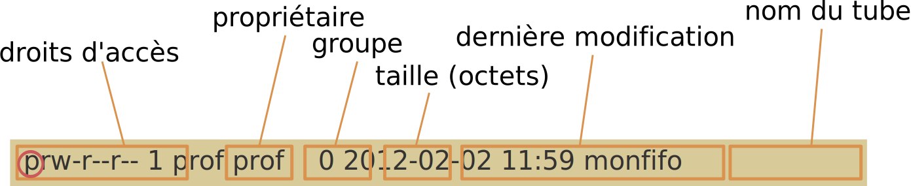


[//]: # (---------------------------------------------------------------------)

---

# Communications interprocessus par tubes nommés (FIFO)


[//]: # (---------------------------------------------------------------------)

---

# À retenir
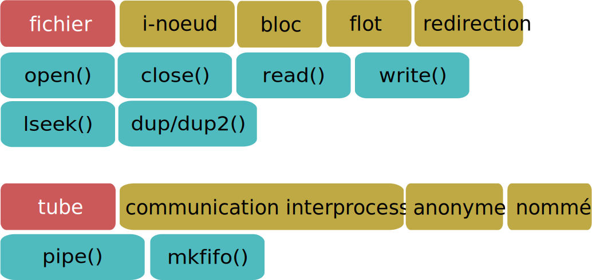

[//]: # (---------------------------------------------------------------------)

---

# Systèmes d'exploitation
## Fichiers et entrées-sorties : exercices

[//]: # (---------------------------------------------------------------------)

---

# Exercice 1
Un système de fichiers UNIX permet de définir des blocs de taille maximale de 512 octets. L'adresse d'un bloc est composée de 4 octets et un i-noeud contient 10 pointeurs directs de blocs, un pointeur indirect simple et un pointeur indirect double.

Quelle est alors la taille maximale d'un fichier (1 Kio = $2^{10}$ octets) ?
(a) 8 Kio
(b) 133 Kio
(c) 5128 Kio
(d) 8261 Kio
(e) aucune des réponses précédentes

[//]: # (---------------------------------------------------------------------)
---

# i-noeud


[//]: # (---------------------------------------------------------------------)

---

# Exercice 1 : correction
$1$ bloc de $512$ peut contenir : $512 / 4$ = $128$ pointeurs
### Taille max. de fichier
$T_{max} = 10 \times 512 +  128 \times 512 + (128 \times 128) \times 512$ 
$T_{max}  = 8459264$  octets
$T_{max} = 8459264 / 2^{10}$ Kio
$T_{max} = 8261$ Kio

Réponse **d**

[//]: # (---------------------------------------------------------------------)

---

# Exercice 2
Combien de blocs sont nécessaires pour stocker un fichier de 2128 Kio sur le  système de fichiers précédent ?
Estimer l'espace perdu sur le disque par ce fichier


[//]: # (---------------------------------------------------------------------)

---

# Exercice 2 : correction
### Blocs nécessaires
$2128$ Kio = $2179072$ octets 
soient $4256$ blocs de $512$ octets

Décomposables en :
$10$ blocs de $512$ + 
$128$ blocs de $512$ +
$128 \times 33$ blocs de $512$

### Espace perdu
$2233344-2179072 = 53$ Kio ($54272$ octets)
Soit environ $2.5$ % de la taille du fichier

[//]: # (---------------------------------------------------------------------)

---

# Exercice 2 : correction
### Précision sur la décomposition

$4256-10=4246$ blocs hors pointeurs directs
$4246-128=4118$ blocs hors pointeurs directs et indirects simples
On cherche donc le nombre de pointeurs indirects doubles $x$ tel que :
$x \ge 4118 / 128$
Soit $x \ge 32.17$, donc $x=33$